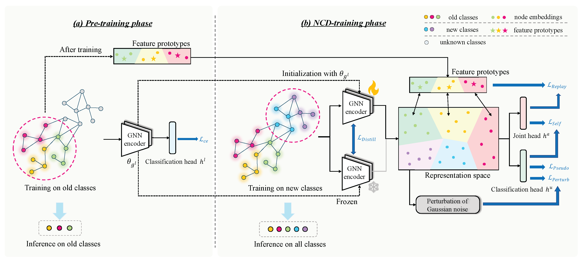

# [CIKM '24] NC2D: Novel Class Discovery for Node Classification

This repository is the official implementation of "[NC$^{2}$D: Novel Class Discovery for Node Classification](https://dl.acm.org/doi/abs/10.1145/3627673.3679779)" accepted by the Proceedings of the 33rd ACM International Conference on Information and Knowledge Management (CIKM '24).

[](https://dl.acm.org/doi/abs/10.1145/3627673.3679779)

------

## 0. Abstract

Novel Class Discovery (NCD) involves identifying new categories within unlabeled data by utilizing knowledge acquired from previously established categories. However, existing NCD methods often struggle to maintain a balance between the performance of old and new categories. Discovering unlabeled new categories in a class-incremental way is more practical but also more challenging, as it is frequently hindered by either catastrophic forgetting of old categories or an inability to learn new ones. Furthermore, the implementation of NCD on continuously scalable graph-structured data remains an under-explored area. In response to these challenges, we introduce for the first time a more practical NCD scenario for node classification (i.e., NC-NCD), and propose a novel self-training framework with prototype replay and distillation called SWORD, adopted to our NC-NCD setting. Our approach enables the model to cluster unlabeled new category nodes after learning labeled nodes while preserving performance on old categories without reliance on old category nodes. SWORD achieves this by employing a self-training strategy to learn new categories and preventing the forgetting of old categories through the joint use of feature prototypes and knowledge distillation. Extensive experiments on four common benchmarks demonstrate the superiority of SWORD over other state-of-the-art methods.


## 1. Requirements

Main package requirements:

- `CUDA == 11.6`
- `Python == 3.10.9`
- `PyTorch == 1.12.0`
- `PyTorch-Geometric == 2.2.0`

To install the complete requiring packages, use the following command at the root directory of the repository:

```setup
pip install -r requirement.txt
```

## 2. Quick Start

### Pre-Training

To pre-train SWORD, run the following command in the directory `./config`:

```shell
python supervise_wossl.py --config config/gcn_cora.yml
python supervise_wossl.py --config config/gcn_citeseer.yml
python supervise_wossl.py --config config/gcn_pubmed.yml
```
Please put the trained model in the directory `./models/save`. We have already provided the pre-trained models for all settings. Note that, the model under evasive adversarial attacks is trained on the clean dataset and tested on the evasive attacked data, so the pre-trained model parameters are the same as models trained on the clean datasets in `./models/save`.

### NCD-Training

For NCD-training phase, run the following command in the directory `./config`:

```shell
python incd_expt_aug.py --config config/gcn_cora.yml
python incd_expt_aug.py --config config/gcn_citeseer.yml
python incd_expt_aug.py --config config/gcn_pubmed.yml
```


### Comparison with state-of-the-art methods
For baseline methods, run the following command in the directory `./config`:
```bash
python incd_expt_sota.py --config config/gcn_cora.yml
```


## 3. Citation
If you find this repository helpful, please consider citing the following paper. We welcome any discussions with [hou_yue@buaa.edu.cn](mailto:hou_yue@buaa.edu.cn).

```bibtex
@inproceedings{hou2024nc2d,
  title={NC2D: Novel Class Discovery for Node Classification},
  author={Hou, Yue and Chen, Xueyuan and Zhu, He and Liu, Ruomei and Shi, Bowen and Liu, Jiaheng and Wu, Junran and Xu, Ke},
  booktitle={Proceedings of the 33rd ACM International Conference on Information and Knowledge Management},
  pages={849--859},
  year={2024}
}
```
